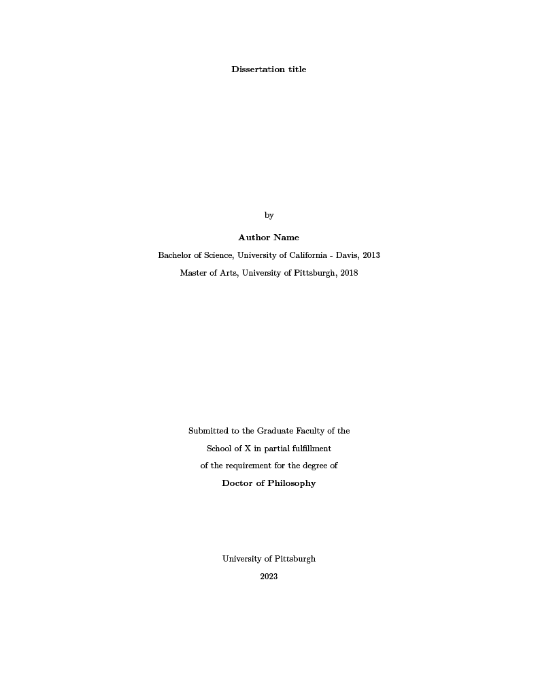

# quarto-dissertation

This is a Quarto extension that renders a PDF of a dissertation/thesis. It was originally designed based on the University of Pittsburgh [LaTeX template](https://etd.pitt.edu/latex-template). This template is intended to help scholars create their own reproducible dissertations/theses.

The extension primarily works using Quarto and a series of LaTeX templates found in the `tex` folder. Additionally, the template was created to be used for a 3-paper dissertation/thesis, although it can be easily modified to accommodate a traditional dissertation – just swap the .qmd files with your dissertation chapters.

Example of complete rendered PDF can be found here: [View PDF](_book/author_diss.pdf)

## Installing the extension

To use this extension, navigate to your desired directory and type the following command in your terminal:

```{bash}
quarto use template alberto-guzman/quarto-dissertation
```

## Installing on an existing document

If you already have an existing Quarto project or document, you may add the template by typing the following in your terminal:

```{bash}
quarto add alberto-guzman/quarto-dissertation
```

### Contributing to the template

Writing my dissertation in Quarto was both exciting and challenging, given that Quarto had just been released. However, I believe Quarto is an amazing tool for creating reproducible dissertations. I plan on gradually creating documentation for this template, but I also welcome the help of contributors!

Happy Writing!

## Example of Rendered Title Page and TOC




